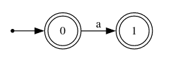

# Projet grep : version étoilée
## Langage utilisé : C
## Principe :
#### Nous chercherons à utiliser l'algorithme de berry sethi pour obtenir un automate reconnaissant l'expression régulière donnée.
- étape 1 : 
    - transformation de l'expression pour construire un arbre la représentant
    - modification sur l'arbre pour supprimer les ?
    - linéarisation de l'expression
- étape 2 : calculs des ensembles P, D et F
- étape 3 : construction d'un automate non déterministe par une version étendue de l'algorithme de Berry Sethi reconnanssant les '.' comme des lettres (preuve du fonctionnement de l'algorithme ci-dessous)
- étape 4 : lecture dans des fichiers et reconnaissance de mots dans l'automate
## Tests :
#### Tout les tests des fonctions sont à la fin du document


# I) Transformations de l'expression régulière :
### But :
- obtenir un arbre représentant la même expression, sans les ? et linéarisée.
### I)1) Pour simplifier les choses plus tard dans les manipulations de tableaux, nous transformerons les expression en tableau d'entiers (les codes ascii associés aux caractères) :
- la structure `regex` représente le tableau obtenu avec sa taille.
- `length_char_array` calcule le nombre de caractère d'une string.
- `char_array_to_regex` effectue la tranformation de la string de l'expression régulière en regex.
- `free_regex` libère la mémoire.
```c
struct regex {
    int length;
    int* content;
};
typedef struct regex regex;

int length_char_array(char* array) {
    int i = 0;
    while(array[i] != '\0') {
        i++;
    }
    return i;
}

regex* char_array_to_regex(char* array) {
    regex* re = malloc(sizeof(regex));
    re->length = length_char_array(array);
    re->content = malloc(sizeof(int)*re->length);
    for(int i = 0; i<re->length; i++) {
        re->content[i] = (int)array[i];
    }
    return re;
}

void free_regex(regex* re) {
    free(re->content);
    free(re);
}
```


### I)2) Création d'arbre pour manipuler les regex :
- `tree` représente un noeud d'un arbre. Les lettres sont les feuilles et les opérateurs les autres noeuds. L'arité des opérateurs est d'au plus deux donc les noeuds ont au plus 2 enfants. Par convention, si l'arité d'un opérateur est 1, son fils droit est un pointeur vers l'arbre vide (`NULL`) et le gauche contient le reste.
- `init_tree` initialise un arbre avec comme étiquette value.
- `free_tree` libère un arbre récursivement.
```c
struct tree {
    int value;
    struct tree* left_child;
    struct tree* right_child;
};
typedef struct tree tree;

tree* init_tree(int value) {
    tree* t = malloc(sizeof(tree));
    t->value = value;
    t->left_child = NULL;
    t->right_child = NULL;
    return t;
}

void free_tree(tree* t) {
    if(t == NULL) {
        return;
    }
    free_tree(t->left_child);
    free_tree(t->right_child);
    free(t);
}
```

### I)3) Création de piles d'arbres pour construire l'arbre représentant une regex :
- `stack` est un tableau `data` de taille `capacity` contenant `size` arbres
- `init_stack` initialise un pile vide de capacité 4.
- `stack_is_empty` vérifie si la pile est vide.
- `free_stack` libère une pile sans libérer les potentiels arbres contenus
- `push` ajoute un élément à la pile et double sa taille si elle est pleine
- `pop` dépile un élément, le renvoie et divise la taille de la pile par 2 si elle est trop vide. Par convention, renvoie `NULL` si la pile est vide.
```c
struct stack {
    int capacity;
    int size;
    tree** data;
};
typedef struct stack stack;

stack* init_stack() {
    stack* s = malloc(sizeof(stack));
    s->data = malloc(sizeof(tree*)*4);
    s->capacity = 4;
    s->size = 0;
    return s;
}

bool stack_is_empty(stack* s) {
    return s->size == 0;
}

void free_stack(stack* s) {
    free(s->data);
    free(s);
}

void push(stack* s, tree* value) {
    s->data[s->size] = value;
    s->size++;
    if (s->size == s->capacity) { //on double la taille de la pile
        s->capacity = s->capacity*2;
        tree** data = malloc(sizeof(tree*)*s->capacity);
        for(int i = 0; i<s->size;i++) {
            data[i] = s->data[i];
        }
        free(s->data);
        s->data = data;
    }
}

tree* pop(stack* s) {
    if (stack_is_empty(s)) {
        return NULL;
    }
    s->size--;
    tree* value = s->data[s->size];
    s->data[s->size] = NULL;
    if(3 < s->capacity && s->size <= s->capacity/4) { //on divise la taille de la pile par deux
        s->capacity = s->capacity/2;
        tree** data = malloc(sizeof(tree*)*s->capacity);
        for(int i = 0; i<s->size; i++) {
            data[i] = s->data[i];
        }
        free(s->data);
        s->data = data;
    }
    return value;
}
```


### I)4) divers outils pour la suite  :
- `is_symbol` renvoie vrai si c représente @, ?, * ou |
- `arite_symbol` renvoie l'arité d'une des 4 opérations (on suppose que `c` code une des opérations)
- `nb_letters` renvoie le nombre de lettres que contient une expression (ε n'en est pas une)
```c
bool is_symbol(int c) {
    return c == (int)'@' || c == (int)'|' || c == (int)'*' || c == (int)'?';
}

int arite_symbol(int c) {
    if (c == (int)'@' || c == (int)'|') {
        return 2;
    }
    return 1;
}

int nb_letters(tree* t) {
    if(t == NULL) {
        return 0;
    }
    if(t->left_child == NULL && t->value >=0) {
        return 1;
    }
    return nb_letters(t->right_child) + nb_letters(t->left_child);
}
```

### I)5) Suppression des opérateurs ? :
- `replace_interog` remplace récursivement les expressions f? par fε| et renvoie l'arbre obtenu (on ne l'utilisera pas directement en pratique)
- `_replace_interog` est utilisé dans `replace_interog` pour effectuer les changements. `t_parent` est le parent de `t`. Il ne peut pas être utilisé si `t_parent == NULL` et si `t->value == (int)'?'`. Ces changements doivent donc être fait dans `replace_interog`.
- `ε` est représenté par l'entier -1
```c
void _replace_interog(tree* t, tree* t_parent) {
    if(t == NULL) {
        return;
    }
    if(t->value == (int)'?') {
        tree* or = init_tree((int)'|');
        or->left_child = t->left_child;
        or->right_child = init_tree(-1); //ε
        if(t_parent->left_child == t) {
            t_parent->left_child = or;
        }
        else {
            t_parent->right_child = or;
        }
        free(t);
        _replace_interog(or->left_child, or);
    }
    else {
        _replace_interog(t->right_child, t);
        _replace_interog(t->left_child, t);
    }
}

tree* replace_interog(tree* t) {
    if(t != NULL && t->value == (int)'?') {
        tree* or = init_tree((int)'|');
        or->left_child = t->left_child;
        or->right_child = init_tree(-1); //ε
        free(t);
        _replace_interog(or->left_child, NULL);
        return or;
    }
    _replace_interog(t, NULL);
    return t;
}
```


### I)6) linéarisation de la regex dans son arbre représentatif :
- `create_correspondence` remplit un tableau `tab_corres` faisant la correspondance entre une lettre et un entier et linéarise l'expression rationnelle dans l'arbre en replaçant le code ascii de la lettre par son code.
    - `tab_corres` est de taille nombre de lettre dans l'expression d'origine et à chaque case associe un unique entier.
    - `i` est un entier qui est incrémenté à chaque attribution de code d'une lettre.
    - exemple : `t = (@ -> (| -> a, b), c)` :
        - à la fin : 
            - `t = (@ -> (| -> 0, 1), 2)`
            - `tab_corres = {a, b, c}
        - (en réalité, ce ne sont pas les lettres qui sont stockées mais leur code ascii)
```c
void create_correspondence(tree* t, int** tab_corres, int* i) {
    if(t == NULL) {
        return;
    }
    if(t->left_child == NULL && t->value >=0) { //le noeud est une feuille de l'arbre et est une lettre (≠ ε)
        (*tab_corres)[*i] = t->value;
        t->value = *i;
        *i = *i+1;
        return;
    }
    create_correspondence(t->left_child, tab_corres, i);
    create_correspondence(t->right_child, tab_corres, i);
}
```

### I)7) Obtention de l'arbre et linéarisation :
- `parse` utilise une pile d'arbre pour construire l'arbre représentatif de la regex `re` et linéarise l'expression :
    - à la lecture de l'expression :
        - si c'est une lettre, on ajoute un arbre de taille 1 ayant cette lettre comme étiquette
        - si c'est un opérateur, on dépile 1 ou 2 fois selon l'arité de l'opérateur et on construit un nouvel arbre avec comme racine l'opérateur et fils les arbres dépilés.
        - Cet algorithme fonctionne grâce à la notation postfixe utilisée.
    - on supprime les opérateurs ?
    - on linéarise dans l'arbre.
```c
tree* parse(regex* re, int** tab_corres) {
    stack* expression = init_stack();
    for(int i = 0; i<re->length; i++) {
        if(is_symbol(re->content[i])) {
            tree* t = init_tree(re->content[i]);
            if(arite_symbol(re->content[i]) == 1) {
                t->left_child = pop(expression);
                //t->right_child = NULL; //déjà initialisé ainsi mais important à savoir
            }
            else {
                t->right_child = pop(expression); //l'ordre de remplissage compte pour la concaténation
                t->left_child = pop(expression);
            }
            push(expression, t);
        }
        else {
            push(expression, init_tree(re->content[i]));
        }
    }
    tree* t = pop(expression);
    free_stack(expression);
    t = replace_interog(t);
    *tab_corres = malloc(sizeof(int)*nb_letters(t));
    int i = 0;
    create_correspondence(t, tab_corres, &i);
    return t;
}
```


# II) Calculs de P, F et D :
### II)1) Structure de liste :
- `list` est une structure permettant de faire des listes chainées pour l'automate et les calculs de P, F et D.
- `empty_list` renvoie la liste vide.
- `create_list` renvoie une liste contenant un élément : `n`
- `list_prepend` renvoie une liste contenant un élément en plus en tête (ne modifie pas `old`)
- `list_remove_first` renvoie une liste contenant le premier élément en moins de la liste en le libérant de la mémoire.
- `free_list` libère une liste.
```c
struct list {
    struct list* next;
    int data;
};
typedef struct list list;

list* empty_list() {
    return NULL;
}

list* create_list(int n){
    list* l = malloc(sizeof(list));
    l->data = n;
    l->next = NULL;
    return l;
}

list* list_prepend(list* old, int n){
    list* l = create_list(n);
    l->next = old;
    return l;
}

list* list_remove_first(list* l){
    list* next = l->next;
    free(l);
    return next;
}

void free_list(list* l) {
    if(l != NULL) {
        free_list(l->next);
        free(l);
    }
}
```


### II)2) Opération sur les listes :
- `union_list` renvoie l'union des 2 listes `l1` et `l2` dans une nouvelle liste et libère les 2 listes initiales si `delete` est vrai.
- `prod_int_list` renvoie le produit cartésien des 2 listes `l1` et `l2` sous forme d'un tableau de taille 2 et libère les 2 listes initiales si `delete` est vrai :
    - `{[1, 2], [3, 4]}` représente la liste de couples `[(1, 3), (2, 4)]`
    - On a les deux listes finales de même taille.
```c
list* union_list(list* l1, list* l2, bool delete) {
    list* l = empty_list();
    while(l1 != NULL) {
        l = list_prepend(l, l1->data);
        if(delete) {
            l1 = list_remove_first(l1);
        }
        else {
            l1 = l1->next;
        }
    }
    while(l2 != NULL) {
        l = list_prepend(l, l2->data);
        if(delete) {
            l2 = list_remove_first(l2);
        }
        else {
            l2 = l2->next;
        }
    }
    return l;
}

list** prod_int_list(list* l1, list* l2, bool delete) {
    list** l = malloc(sizeof(list*)*2);
    l[0] = empty_list();
    l[1] = empty_list();
    list* l2_c = l2; //la variable l2_c sert au parcours de la liste l2 sans perdre son premier élément
    while(l1!=NULL) {
        while(l2_c != NULL) {
            l[0] = list_prepend(l[0], l1->data);
            l[1] = list_prepend(l[1], l2_c->data);
            l2_c = l2_c->next;
        }
        l2_c = l2;
        if(delete) {
            l1 = list_remove_first(l1);
        }
        else {
            l1 = l1->next;
        }
    }
    if(delete) {
        free_list(l2);
    }
    return l;
}
```


### II)3) une expression admet-elle ε ?
- `admit_epsilon` renvoie vrai si l'expression régulière représentée par t admet ε.
```c
bool admit_epsilon(tree* t) {
    if(t == NULL || (t->left_child == NULL && t->value >= 0)) {
        return false;
    }
    if(t->value == -1 || t->value == (int)'*') {
        return true;
    }
    if(t->value == (int)'|') {
        return admit_epsilon(t->left_child) || admit_epsilon(t->right_child);
    }
    return admit_epsilon(t->right_child) && admit_epsilon(t->left_child);
}
```


### II)4) Calculs de P et D :
- `calc_P` renvoie la liste des premières lettres des mots dénotés par l'expression représentée par `t`.
- `calc_D` renvoie la liste des dernières lettres des mots dénotés par l'expression représentée par `t`.
```c
list* calc_P(tree* t) {
    if(t == NULL || t->value == -1) { //arbre vide ou ε
        return empty_list();
    }
    else if(t->left_child == NULL) { //une lettre
        return create_list(t->value);
    }
    else if(t->value == (int)'|') {
        return union_list(calc_P(t->left_child), calc_P(t->right_child), true);
    }
    else if(t->value == (int)'@' && admit_epsilon(t->left_child)) {
        return union_list(calc_P(t->left_child), calc_P(t->right_child), true);
    }
    else if(t->value == (int)'@') {
        return calc_P(t->left_child);
    }
    else {
        return calc_P(t->left_child);
    }
}

list* calc_D(tree* t) {
    if(t == NULL || t->value == -1) { //arbre vide ou ε
        return empty_list();
    }
    else if(t->left_child == NULL) { //une lettre
        return create_list(t->value);
    }
    else if(t->value == (int)'|') {
        return union_list(calc_D(t->left_child), calc_D(t->right_child), true);
    }
    else if(t->value == (int)'@' && admit_epsilon(t->right_child)) {
        return union_list(calc_D(t->left_child), calc_D(t->right_child), true);
    }
    else if(t->value == (int)'@') {
        return calc_D(t->right_child);
    }
    else {
        return calc_D(t->left_child);
    }
}
```

### II)5) Opérations sur les couples de listes pour calculer F :
- `empty_couple_list` renvoie le liste de couple vide.
- `union_couple_list` fait l'union de deux listes de couples `l1` et `l2` en suivant le même principe que la fontion `union_list`
```c
list** empty_couple_list() {
    list** l = malloc(sizeof(list*)*2);
    l[0] = empty_list();
    l[1] = empty_list();
    return l;
}

list** union_couple_list(list** l1, list** l2, bool delete) {
    list** l3 = empty_couple_list();
    l3[0] = union_list(l1[0], l2[0], delete);
    l3[1] = union_list(l1[1], l2[1], delete);
    if(delete) {
        free(l1);
        free(l2);
    }
    return l3;
}
```

### II)6) Calcul de F :
- `calc_F` renvoie la liste des facteurs de taille 2 des mots dénotés par l'expression représentée par `t`
```c
list** calc_F(tree* t) {
    if(t == NULL || t->left_child == NULL) { //arbre vide, une lettre ou ε
        return empty_couple_list();
    }
    else if(t->value == (int)'|') {
        return union_couple_list(calc_F(t->left_child), calc_F(t->right_child), true);
    }
    else if(t->value == (int)'@') {
        return union_couple_list(union_couple_list(calc_F(t->left_child), calc_F(t->right_child), true), prod_int_list(calc_D(t->left_child), calc_P(t->right_child), true), true);
    }
    else {
        return union_couple_list(calc_F(t->left_child), prod_int_list(calc_D(t->left_child), calc_P(t->left_child), true), true);
    }
}
```

# III) Calcul d'un automate reconnaissant une expression régulière :
### III)1) Preuve du fonctionnement de Berry Sethi étendu au caractère '.' :


### III)2) Structure de l'automate :
`automate` représente un automate non déterministe.
- `nb_etats` est le nombre d'états de l'automate
- `etat_initial` est l'état initial de l'automate (unique dans le cas de Berry Sethi
- `etats_finaux` est un tableau de booléen de taille `nb_etats`. Si l'état i est final, `etats_finaux[i]` est vrai
- `delta` :
    - tableau de taille `nb_etats`
        - chaque case contient un tableau de taille 256 (une case pour chaque caractère ascii)
            - chaque case des sous tableaux contient une liste d'états d'arrivés car l'automate est non déterministe
`free_automate` libère un automate de la mémoire.
```c
struct automate {
    int nb_etats;
    int etat_initial;
    bool* etats_finaux;
    list*** delta;
};
typedef struct automate automate;

void free_automate(automate* a) {
    free(a->etats_finaux);
    for(int i = 0; i<a->nb_etats; i++) {
        for(int j = 0; j<256; j++) {
            free_list(a->delta[i][j]);
        }
        free(a->delta[i]);
    }
    free(a->delta);
    free(a);
}
```

### III)3) Création d'un automate reconnaissant une expression régulière :
- `create_automate` renvoie un automate non déterministe reconnaissant l'expression linéarisée représentée par `t` avec `tab_corres` faisant le lien entre les lettres linéarisées et les caractères ascii :
    - l'automate n+1 lettre où n est le nombre de lettres dans l'arbre obtenu par parse
    - les états finaux sont ceux dans l'ensemble D, +1 (décalage car l'état 0 est l'état ε dans Berry Sethi et qu'on linéarise en partant de 0).
    - si l'expression reconnaît ε alors 0 est un état final.
    - Les transitions de l'état 0 vers les autres se font via l'ensemble P
    - les autres transitions ne concernant pas 0 sont calculées à partir de l'ensemble F.
```c
automate* create_automate(tree* t, int* tab_corres) {
    list* p = calc_P(t);
    list* d = calc_D(t);
    list** f= calc_F(t);
    //variables pour le parcours :
    list* parc_p = p;
    list* parc_d = d;
    list* parc_f0 = f[0];
    list* parc_f1 = f[1];
    automate* a = malloc(sizeof(automate));
    a->nb_etats = nb_letters(t)+1; //+1 pour l'état initial
    a->etat_initial = 0;
    //états finaux (à partir de D):
    a->etats_finaux = malloc(sizeof(bool)*a->nb_etats);
    for(int i = 0; i<a->nb_etats; i++) {
        a->etats_finaux[i] = false;
    }
    while(parc_d != NULL) {
        a->etats_finaux[parc_d->data+1] = true;
        parc_d = parc_d->next;
    }
    a->etats_finaux[0] = admit_epsilon(t);
    //remplissage de delta :
    a->delta = malloc(sizeof(list**)*a->nb_etats);
    for(int i = 0; i<a->nb_etats; i++) {
        a->delta[i] = malloc(sizeof(list*)*256);
        for(int j = 0; j<256; j++) {
            a->delta[i][j] = empty_list();
        }
    }
    //transitions partant de l'état initial (à partir de P):
    while(parc_p != NULL) {
        a->delta[0][tab_corres[parc_p->data]] = list_prepend(a->delta[0][tab_corres[parc_p->data]], parc_p->data+1);
        parc_p = parc_p->next;
    }
    //transitions entre les autres états (à partir de F) :
    while(parc_f0 != NULL) {
        a->delta[parc_f0->data+1][tab_corres[parc_f1->data]] = list_prepend(a->delta[parc_f0->data+1][tab_corres[parc_f1->data]], parc_f1->data+1);
        parc_f0 = parc_f0->next;
        parc_f1 = parc_f1->next;
    }
    
    free_list(p);
    free_list(d);
    free_list(f[0]);
    free_list(f[1]);
    free(f);
    return a;
}
```

# IV) Lecture dans l'automate :
### IV)1) Vérifier si une chaîne de caractères est reconnue par un automate :
- `recognize_line` renvoie `true` si la ligne est reconnue par l'automate `a` donné en entrée, `false` sinon
- fonctionnement :
    on utilise deux tableaus positions de taille `a->nb_etats` pour enregistrer les positions actuelles dans l'automate (`old_position`) et les nouvelles après la lecture d'une lettre dans la string `line` (`new_position`)
    
```c
bool recognize_line(automate* a, char* line) {
    int n = length_char_array(line)-1; //nombre de caractère de la ligne -1 pour le retour à la ligne
    if(n<0) {
        return false;
    }
    bool* old_position = malloc(sizeof(bool)*a->nb_etats);
    bool* new_position = malloc(sizeof(bool)*a->nb_etats);
    clear_position(old_position, a->nb_etats);
    clear_position(new_position, a->nb_etats);
    old_position[a->etat_initial] = true;
    bool* tmp; //sert pour l'échange de old_position et new_position
    for(int i = 0; i<n; i++) {
        for(int j = 0; j<a->nb_etats; j++) {
            if(old_position[j]) {
                list* l = a->delta[j][(int)line[i]];
                while(l != NULL) {
                    new_position[l->data] = true;
                    l = l->next;
                }
                //Le '.' représente nimporte quel caractère donc celui qu'on lit.
                //On ajoute donc les transitions faites par '.'
                l = a->delta[j][(int)'.'];
                while(l != NULL) {
                    new_position[l->data] = true;
                l = l->next;
                }
                old_position[j] = false;
            }
        }
        //à la fin, old_position ne contient que des false, on inverse donc old et new position.
        tmp = old_position;
        old_position = new_position;
        new_position = tmp;
    }
    //On regarde si l'un des états obtenus par la lecture dans l'automate est final :
    bool ret = false;
    for(int i = 0; i<a->nb_etats; i++) {
        if(a->etats_finaux[i] && old_position[i]) {
            ret = true;
        }
    }
    free(old_position);
    free(new_position);
    return ret;
}
```


### IV)2) Lecture des lignes d'un document :
- `get_lines` parcours toutes les lignes du fichier de nom `file_name` et vérifie ligne par ligne si elle est reconnue par l'automate `a`. Si c'est le cas, elle affiche le numéro de la ligne et son contenu.
```c
void get_lines(automate* a, char* file_name) {
    FILE* file = fopen(file_name, "r");
    char line[1000]; //On suppose que les lignes font moins de 1000 caractères.
    int i = 0;
    while(fgets(line, sizeof(line), file) != NULL) {
        if(recognize_line(a, line)) {
            printf("%d : %s", i, line);
        }
        i++;
    }
    fclose(file);
    return;
}
```

# Réponses aux questions :
### 2) Mots qui contiennent un w et un q :
```
> ./mygrep.bin '.*q@.*@w@.*@.*w@.*@q@.*@|' francais.txt
53525 : clownesque
53526 : clownesques
290908 : squaw
290909 : squaws
322477 : wisigothique
322478 : wisigothiques
```
Ainsi, les mots qui contiennent un w et un q sont "clownesque", "clownesques", "squaw", "squaws", "wisigothique" et "wisigothiques"

### 3) Temps d'éxécutions à la lecture des fichiers aXXb.txt :
- temps réel d'éxécution de mygrep :
    - a20b.txt : 0.035s
    - a25b.txt : 0.034s
    - a30b.txt : 0.036s
    - a35b.txt : 0.040s
    - a40b.txt : 0.036s
- temps réel d'éxécution de grep :
    - a20b.txt : 0.007s
    - a25b.txt : 0.012s
    - a30b.txt : 0.010s
    - a35b.txt : 0.010s
    - a40b.txt : 0.006s
    
Nous pouvons nous satisfaire de ces résultats qui sont relativement proches des temps d'éxécutions de grep (3 à 4 fois plus longs). De plus, en retirant les options de compilation, les temps d'éxécution de mygrep sont divisés par 2 voir 3.

# Test
### 1) Fonctions d'affichages :
- `print_tree_symbols` affiche l'arbre `t` en affichant les opérateurs contenus à l'intérieur.
- `print_stack_symbols` affiche le contenu de la pile `s` (donc les arbres qu'elle contient).
- `print_tab_corres` affiche le tableau de correspondance caractère ascii - code dans l'expression linéarisée.
- `print_int_list` affiche la liste d'entier `l`.
- `print_couple_int_list` affiche la liste de couple d'entier `l`.
```c
void print_tree_symbols(tree* t) {
    if(t == NULL) {
        return;
    }
    if(is_symbol(t->value)) {
        printf("%c -> (", (char)t->value);
    }
    else{
        printf("%d -> (", t->value);
    }
    print_tree_symbols(t->left_child);
    if(t->right_child != NULL) {
        printf(", ");
        print_tree_symbols(t->right_child);
    }
    printf(")");
}

void print_stack_symbols(stack* s) {
    printf("[");
    for(int i = 0; i<s->size-1; i++) {
        print_tree_symbols(s->data[i]);
        printf(", ");
    }
    if(s->size != 0) {
        print_tree_symbols(s->data[s->size-1]);
    }
    printf("]\n");
}

void print_tab_corres(int* tab_corres, int size) {
    for(int i = 0; i<size; i++) {
        printf("%d : %c, ", i, (char) tab_corres[i]);
    }
    printf("\n");
}

void print_int_list(list* l) {
    while(l != NULL) {
        printf("%d ", l->data);
        l = l->next;
    }
    printf("\n");
}

void print_couple_int_list(list** l) {
    list* l0 = l[0];
    list* l1 = l[1];
    while(l0 != NULL) {
        printf("(%d, %d) ", l0->data, l1->data);
        l0 = l0->next;
        l1 = l1->next;
    }
    printf("\n");
}
```

### 2) Tests des piles et de replace_interog:
```c
int main() {
    tree* t;
    //stack vide :
    stack* s = init_stack();
    printf("capacité de la pile : %d\n", s->capacity);
    print_stack_symbols(s);
    //pile contenant 5 arbres de taille 1 : 0, 1, 2, 3, 4 pour doubler la taille de la pile :
    push(s, init_tree(0));
    push(s, init_tree(1));
    push(s, init_tree(2));
    push(s, init_tree(3));
    push(s, init_tree(4));
    printf("capacité de la pile : %d\n", s->capacity);
    print_stack_symbols(s);
    //on dépile 3 arbres pour diminuer la capacité de la pile :
    t = pop(s);
    free_tree(t);
    t = pop(s);
    free_tree(t);
    t = pop(s);
    free_tree(t);
    printf("capacité de la pile : %d\n", s->capacity);
    print_stack_symbols(s);
    //on change le dernier arbre pour 1?
    t = init_tree((int)'?');
    t->left_child = pop(s);
    push(s, t);
    print_stack_symbols(s);
    //on construit un arbre de racine @ et aillant comme fils les 2 arbres de la pile :
    t = init_tree((int)'@');
    t->right_child = pop(s);
    t->left_child = pop(s);
    push(s, t);
    print_stack_symbols(s);
    ////on construit un arbre de racine ? et aillant comme fils l'arbre dans la pile :
    t = init_tree((int)'?');
    t->left_child = pop(s);
    push(s, t);
    print_stack_symbols(s);
    //on dépile l'arbre :
    t = pop(s);
    print_stack_symbols(s);
    //on remplace les ? :
    t = replace_interog(t);
    print_tree_symbols(t);
    printf("\n");

    free_tree(t);
    free_stack(s);
    return 0;
}
```
résultat :
```
capacité de la pile : 4
[]
capacité de la pile : 8
[0 -> (), 1 -> (), 2 -> (), 3 -> (), 4 -> ()]
capacité de la pile : 4
[0 -> (), 1 -> ()]
[0 -> (), ? -> (1 -> ())]
[@ -> (0 -> (), ? -> (1 -> ()))]
[? -> (@ -> (0 -> (), ? -> (1 -> ())))]
[]
| -> (@ -> (0 -> (), | -> (1 -> (), ε -> ())), ε -> ())
```

### 3) Tests de parse :
- `print_result_parse` affiche l'arbre obtenu et le tableau de correspondance.
```c
void print_result_parse(char* s) {
    regex* re = char_array_to_regex(s);
    int* tab_corres;
    tree* t = parse(re, &tab_corres);
    print_tree_symbols(t);
    printf("\n");
    print_tab_corres(tab_corres, nb_letters(t));
    free_tree(t);
    free(tab_corres);
    free_regex(re);
    printf("\n");
}

int main() {
    //test sur les opérateurs et les lettres :
    print_result_parse("a");
    print_result_parse("a*");
    print_result_parse("a?");
    print_result_parse("aa@");
    print_result_parse("aa|");
    //même exemple que celui détaillé au dessus mais directement avec la fonction parse :
    print_result_parse("ab?@?");
    return 0;
}
```
résultats : 
```
0 -> ()
0 : a, 

* -> (0 -> ())
0 : a, 

| -> (0 -> (), ε -> ())
0 : a, 

@ -> (0 -> (), 1 -> ())
0 : a, 1 : a, 

| -> (0 -> (), 1 -> ())
0 : a, 1 : a, 

| -> (@ -> (0 -> (), | -> (1 -> (), ε -> ())), ε -> ())
0 : a, 1 : b,
```
on obtient ainsi bien le même arbre que lors du test précédent déroulé à la main.

### 4) Tests des calculs de P, D et F :
- `print_pdf` affiche les ensembles P, D et F induit par la string `s`.
```c
void print_pdf(char* s) {
    regex* re = char_array_to_regex(s);
    int* tab_corres;
    tree* t = parse(re, &tab_corres);
    print_tree_symbols(t);
    printf("\n");

    list* p = calc_P(t);
    list* d = calc_D(t);
    list** f= calc_F(t);
    printf("P = ");
    print_int_list(p);
    printf("D = ");
    print_int_list(d);
    printf("F = ");
    print_couple_int_list(f);
    free_list(p);
    free_list(d);
    free_list(f[0]);
    free_list(f[1]);
    free(f);
    free_tree(t);
    free(tab_corres);
    free_regex(re);
}

int main() {
    print_pdf("a");
    print_pdf("a*");
    print_pdf("a?");
    print_pdf("aa@");
    print_pdf("aa|");
    return 0;
}
```
résultats :
```
0 -> ()
P = 0 
D = 0 
F = 
* -> (0 -> ())
P = 0 
D = 0 
F = (0, 0) 
| -> (0 -> (), ε -> ())
P = 0 
D = 0 
F = 
@ -> (0 -> (), 1 -> ())
P = 0 
D = 1 
F = (0, 1) 
| -> (0 -> (), 1 -> ())
P = 1 0 
D = 1 0 
F =
```

### 5) Tests de de construction des automates :
- `ecrire_automate` enregistre l'automate `a` dans un fichier `nom` sous le format viz pour le lire sur [ce site](http://magjac.com/graphviz-visual-editor/)
- `write_automate_of_string` enregistre l'automate reconnaissant le même langage que celui dénoté par `a`
```c
void ecrire_automate(automate* a, char* nom) {
    FILE* flux = fopen(nom, "w");
    fprintf(flux, "digraph a {\nrankdir = LR;\n");
    for (int i = 0; i < a->nb_etats; i++)
    {
        if (a->etats_finaux[i]) 
        {
            fprintf(flux, "node [shape = doublecircle, label = %d] %d;\n", i, i);
        }
        else
        {
            fprintf(flux, "node [shape = circle, label = %d] %d;\n", i, i);
        }
    }
    fprintf(flux, "node [shape = point]; I\n");
    fprintf(flux, "I -> %d;\n", a->etat_initial);
    for (int i = 0; i < a->nb_etats; i++)
    {
        for (int j = 0; j < 256; j++)
        {   
            list* l = a->delta[i][j];
            while(l != NULL)
            {
                fprintf(flux, "%d -> %d [label = \"%c\"];\n", i, l->data, (char) (j));
                l = l->next;
            }
        }
    }
    fprintf(flux, "}");
    fclose(flux);
}

void write_automate_of_string(char* s, char* name) {
    regex* re = char_array_to_regex(s);
    int* tab_corres;
    tree* t = parse(re, &tab_corres);
    automate* a = create_automate(t, tab_corres);
    ecrire_automate(a, name);
    free_automate(a);
    free_tree(t);
    free(tab_corres);
    free_regex(re);
}

int main() {
    write_automate_of_string("", "auto0.viz");
    write_automate_of_string("a", "auto1.viz");
    write_automate_of_string("a*", "auto2.viz");
    write_automate_of_string("a?", "auto3.viz");
    write_automate_of_string("aa@", "auto4.viz");
    write_automate_of_string("ab|", "auto5.viz");
    write_automate_of_string("a.?@", "auto6.viz");
}
```
Résultats :

auto0 : 
auto1 : 
auto2 : 
auto3 : 
auto4 : 
auto5 : 
auto6 : 
